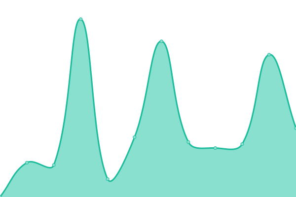
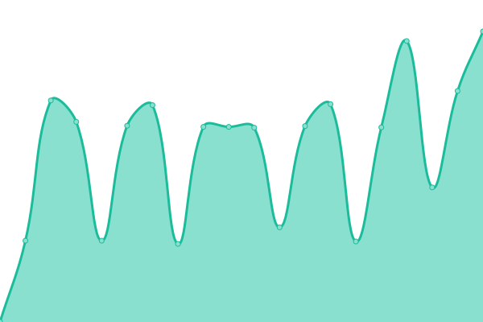

# [📈 Live Status](https://demo.upptime.js.org): <!--live status--> **🟧 Partial outage**

This repository contains the open-source uptime monitor and status page for [Michael Büchner](https://www.buechner.xyz), powered by [Upptime](https://github.com/upptime/upptime).

With [Upptime](https://upptime.js.org), you can get your own unlimited and free uptime monitor and status page, powered entirely by a GitHub repository. We use [Issues](https://github.com/mbuechner/mbuechner/ddbstatus/issues) as incident reports, [Actions](https://github.com/mbuechner/mbuechner/ddbstatus/actions) as uptime monitors, and [Pages](https://demo.upptime.js.org) for the status page.

<!--start: status pages-->
<!-- This summary is generated by Upptime (https://github.com/upptime/upptime) -->
<!-- Do not edit this manually, your changes will be overwritten -->
<!-- prettier-ignore -->
| URL | Status | History | Response Time | Uptime |
| --- | ------ | ------- | ------------- | ------ |
|  [Subportal „Archivportal-D“](https://www.archivportal-d.de) | Aktiv | [subportal-archivportal-d.yml](https://github.com/mbuechner/ddbstatus/commits/HEAD/history/subportal-archivportal-d.yml) | 

 855ms
     
 | 

<a href="https://mbuechner.github.io/ddbstatus/history/subportal-archivportal-d">100.00%</a>
    

|  [Filesharing von Coding da Vinci](https://download.codingdavinci.de) | Inaktiv | [filesharing-von-coding-da-vinci.yml](https://github.com/mbuechner/ddbstatus/commits/HEAD/history/filesharing-von-coding-da-vinci.yml) | 

 2222ms
     
 | 

<a href="https://mbuechner.github.io/ddbstatus/history/filesharing-von-coding-da-vinci">64.93%</a>
    

|  [Webanalytik von Coding da Vinci](https://report.codingdavinci.de) | Aktiv | [webanalytik-von-coding-da-vinci.yml](https://github.com/mbuechner/ddbstatus/commits/HEAD/history/webanalytik-von-coding-da-vinci.yml) | 

 3807ms
     
 | 

<a href="https://mbuechner.github.io/ddbstatus/history/webanalytik-von-coding-da-vinci">100.00%</a>
    

|  [Coding da Vinci](https://codingdavinci.de) | Aktiv | [coding-da-vinci.yml](https://github.com/mbuechner/ddbstatus/commits/HEAD/history/coding-da-vinci.yml) | 

 1171ms
     
 | 

<a href="https://mbuechner.github.io/ddbstatus/history/coding-da-vinci">100.00%</a>
    

|  [Datendienst „Entity Facts“](https://hub.culturegraph.org/entityfacts/118540238) | Aktiv | [datendienst-entity-facts.yml](https://github.com/mbuechner/ddbstatus/commits/HEAD/history/datendienst-entity-facts.yml) | 

 3455ms
     
 | 

<a href="https://mbuechner.github.io/ddbstatus/history/datendienst-entity-facts">99.22%</a>
    

|  [API](https://api.deutsche-digitale-bibliothek.de) | Aktiv | [api.yml](https://github.com/mbuechner/ddbstatus/commits/HEAD/history/api.yml) | 

 1771ms
     
 | 

<a href="https://mbuechner.github.io/ddbstatus/history/api">100.00%</a>
    

|  [Virtuelle Ausstellungen](https://ausstellungen.deutsche-digitale-bibliothek.de/regen/) | Aktiv | [virtuelle-ausstellungen.yml](https://github.com/mbuechner/ddbstatus/commits/HEAD/history/virtuelle-ausstellungen.yml) | 

 3803ms
     
 | 

<a href="https://mbuechner.github.io/ddbstatus/history/virtuelle-ausstellungen">100.00%</a>
    

|  [Redaktionssystem der Virtuellen Ausstellungen](https://ausstellungen-red.deutsche-digitale-bibliothek.de/) | Aktiv | [redaktionssystem-der-virtuellen-ausstellungen.yml](https://github.com/mbuechner/ddbstatus/commits/HEAD/history/redaktionssystem-der-virtuellen-ausstellungen.yml) | 

 620ms
     
 | 

<a href="https://mbuechner.github.io/ddbstatus/history/redaktionssystem-der-virtuellen-ausstellungen">100.00%</a>
    

|  [Subportal „Sammlungsgut aus kolonialen Kontexten“](https://ccc.deutsche-digitale-bibliothek.de) | Aktiv | [subportal-sammlungsgut-aus-kolonialen-kontexten.yml](https://github.com/mbuechner/ddbstatus/commits/HEAD/history/subportal-sammlungsgut-aus-kolonialen-kontexten.yml) | 

 871ms
     
 | 

<a href="https://mbuechner.github.io/ddbstatus/history/subportal-sammlungsgut-aus-kolonialen-kontexten">99.83%</a>
    

|  [Content Management System](https://cms.deutsche-digitale-bibliothek.de) | Aktiv | [content-management-system.yml](https://github.com/mbuechner/ddbstatus/commits/HEAD/history/content-management-system.yml) | 

 668ms
     
 | 

<a href="https://mbuechner.github.io/ddbstatus/history/content-management-system">100.00%</a>
    

|  [Datashare](https://datashare.deutsche-digitale-bibliothek.de/) | Aktiv | [datashare.yml](https://github.com/mbuechner/ddbstatus/commits/HEAD/history/datashare.yml) | 

 4295ms
     
 | 

<a href="https://mbuechner.github.io/ddbstatus/history/datashare">100.00%</a>
    

|  [DDBgo](https://go.deutsche-digitale-bibliothek.de) | Aktiv | [dd-bgo.yml](https://github.com/mbuechner/ddbstatus/commits/HEAD/history/dd-bgo.yml) | 

 512ms
     
 | 

<a href="https://mbuechner.github.io/ddbstatus/history/dd-bgo">100.00%</a>
    

|  [IIIF-Service](https://iiif.deutsche-digitale-bibliothek.de/image/2/01610200-7559-47e9-8f7c-bd4323cbd794/full/full/0/default.jpg) | Aktiv | [iiif-service.yml](https://github.com/mbuechner/ddbstatus/commits/HEAD/history/iiif-service.yml) | 

 1222ms
     
 | 

<a href="https://mbuechner.github.io/ddbstatus/history/iiif-service">100.00%</a>
    

|  [Jira](https://jira.deutsche-digitale-bibliothek.de) | Aktiv | [jira.yml](https://github.com/mbuechner/ddbstatus/commits/HEAD/history/jira.yml) | 

 731ms
     
 | 

<a href="https://mbuechner.github.io/ddbstatus/history/jira">100.00%</a>
    

|  [DDBlabs: Beagen](https://labs.deutsche-digitale-bibliothek.de/app/beagen) | Aktiv | [dd-blabs-beagen.yml](https://github.com/mbuechner/ddbstatus/commits/HEAD/history/dd-blabs-beagen.yml) | 

 460ms
     
 | 

<a href="https://mbuechner.github.io/ddbstatus/history/dd-blabs-beagen">100.00%</a>
    

|  [DDBlabs: DDBapi](https://labs.deutsche-digitale-bibliothek.de/app/ddbapi) | Aktiv | [dd-blabs-dd-bapi.yml](https://github.com/mbuechner/ddbstatus/commits/HEAD/history/dd-blabs-dd-bapi.yml) | 

 223ms
     
 | 

<a href="https://mbuechner.github.io/ddbstatus/history/dd-blabs-dd-bapi">100.00%</a>
    

|  [DDBlabs: DDBid](https://labs.deutsche-digitale-bibliothek.de/app/ddbid) | Aktiv | [dd-blabs-dd-bid.yml](https://github.com/mbuechner/ddbstatus/commits/HEAD/history/dd-blabs-dd-bid.yml) | 

 743ms
     
 | 

<a href="https://mbuechner.github.io/ddbstatus/history/dd-blabs-dd-bid">100.00%</a>
    

|  [DDBlabs: DDBIdGen](https://labs.deutsche-digitale-bibliothek.de/app/ddbidgen) | Aktiv | [dd-blabs-ddb-id-gen.yml](https://github.com/mbuechner/ddbstatus/commits/HEAD/history/dd-blabs-ddb-id-gen.yml) | 

 334ms
     
 | 

<a href="https://mbuechner.github.io/ddbstatus/history/dd-blabs-ddb-id-gen">100.00%</a>
    

|  [DDBlabs: DDBmeme](https://labs.deutsche-digitale-bibliothek.de/app/ddbmeme) | Aktiv | [dd-blabs-dd-bmeme.yml](https://github.com/mbuechner/ddbstatus/commits/HEAD/history/dd-blabs-dd-bmeme.yml) | 

 272ms
     
 | 

<a href="https://mbuechner.github.io/ddbstatus/history/dd-blabs-dd-bmeme">100.00%</a>
    

|  [DDBlabs: EF2SO](https://labs.deutsche-digitale-bibliothek.de/app/ef2so/118540238) | Aktiv | [dd-blabs-ef-2-so.yml](https://github.com/mbuechner/ddbstatus/commits/HEAD/history/dd-blabs-ef-2-so.yml) | 

 622ms
     
 | 

<a href="https://mbuechner.github.io/ddbstatus/history/dd-blabs-ef-2-so">99.24%</a>
    

|  [DDBlabs: IIIF](https://labs.deutsche-digitale-bibliothek.de/iiif/presentation/3) | Aktiv | [dd-blabs-iiif.yml](https://github.com/mbuechner/ddbstatus/commits/HEAD/history/dd-blabs-iiif.yml) | 

 448ms
     
 | 

<a href="https://mbuechner.github.io/ddbstatus/history/dd-blabs-iiif">100.00%</a>
    

|  [DDBlabs: IIIF Presentation](https://labs.deutsche-digitale-bibliothek.de/app/iiif-presentation) | Aktiv | [dd-blabs-iiif-presentation.yml](https://github.com/mbuechner/ddbstatus/commits/HEAD/history/dd-blabs-iiif-presentation.yml) | 

 225ms
     
 | 

<a href="https://mbuechner.github.io/ddbstatus/history/dd-blabs-iiif-presentation">100.00%</a>
    

|  [DDBlabs: ZDBdump](https://labs.deutsche-digitale-bibliothek.de/app/zdbdump) | Aktiv | [dd-blabs-zd-bdump.yml](https://github.com/mbuechner/ddbstatus/commits/HEAD/history/dd-blabs-zd-bdump.yml) | 

 337ms
     
 | 

<a href="https://mbuechner.github.io/ddbstatus/history/dd-blabs-zd-bdump">100.00%</a>
    

|  [Kartenserver](https://maps.deutsche-digitale-bibliothek.de/) | Aktiv | [kartenserver.yml](https://github.com/mbuechner/ddbstatus/commits/HEAD/history/kartenserver.yml) | 

 609ms
     
 | 

<a href="https://mbuechner.github.io/ddbstatus/history/kartenserver">100.00%</a>
    

|  [DDBmint](https://mint.deutsche-digitale-bibliothek.de) | Aktiv | [dd-bmint.yml](https://github.com/mbuechner/ddbstatus/commits/HEAD/history/dd-bmint.yml) | 

 467ms
     
 | 

<a href="https://mbuechner.github.io/ddbstatus/history/dd-bmint">100.00%</a>
    

|  [Metadata Quality Assessment](https://mqa.deutsche-digitale-bibliothek.de) | Aktiv | [metadata-quality-assessment.yml](https://github.com/mbuechner/ddbstatus/commits/HEAD/history/metadata-quality-assessment.yml) | 

 476ms
     
 | 

<a href="https://mbuechner.github.io/ddbstatus/history/metadata-quality-assessment">100.00%</a>
    

|  [DDBoai](https://oai.deutsche-digitale-bibliothek.de) | Aktiv | [dd-boai.yml](https://github.com/mbuechner/ddbstatus/commits/HEAD/history/dd-boai.yml) | 

 587ms
     
 | 

<a href="https://mbuechner.github.io/ddbstatus/history/dd-boai">100.00%</a>
    

|  [DDBpro](https://pro.deutsche-digitale-bibliothek.de) | Aktiv | [dd-bpro.yml](https://github.com/mbuechner/ddbstatus/commits/HEAD/history/dd-bpro.yml) | 

 824ms
     
 | 

<a href="https://mbuechner.github.io/ddbstatus/history/dd-bpro">100.00%</a>
    

|  [Registrierung](https://registrierung.deutsche-digitale-bibliothek.de) | Aktiv | [registrierung.yml](https://github.com/mbuechner/ddbstatus/commits/HEAD/history/registrierung.yml) | 

 668ms
     
 | 

<a href="https://mbuechner.github.io/ddbstatus/history/registrierung">100.00%</a>
    

|  [Webanalytik](https://report.deutsche-digitale-bibliothek.de/) | Aktiv | [webanalytik.yml](https://github.com/mbuechner/ddbstatus/commits/HEAD/history/webanalytik.yml) | 

 1124ms
     
 | 

<a href="https://mbuechner.github.io/ddbstatus/history/webanalytik">98.42%</a>
    

|  [DDBviewer](https://viewer.deutsche-digitale-bibliothek.de/) | Aktiv | [dd-bviewer.yml](https://github.com/mbuechner/ddbstatus/commits/HEAD/history/dd-bviewer.yml) | 

 2268ms
     
 | 

<a href="https://mbuechner.github.io/ddbstatus/history/dd-bviewer">100.00%</a>
    

|  [DDBviewer fürs Zeitungsportal](https://viewer-dzp.deutsche-digitale-bibliothek.de) | Aktiv | [dd-bviewer-fuers-zeitungsportal.yml](https://github.com/mbuechner/ddbstatus/commits/HEAD/history/dd-bviewer-fuers-zeitungsportal.yml) | 

 692ms
     
 | 

<a href="https://mbuechner.github.io/ddbstatus/history/dd-bviewer-fuers-zeitungsportal">100.00%</a>
    

|  [DDBwebmail](https://webmail.deutsche-digitale-bibliothek.de/) | Aktiv | [dd-bwebmail.yml](https://github.com/mbuechner/ddbstatus/commits/HEAD/history/dd-bwebmail.yml) | 

 2626ms
     
 | 

<a href="https://mbuechner.github.io/ddbstatus/history/dd-bwebmail">100.00%</a>
    

|  [Wiki](https://wiki.deutsche-digitale-bibliothek.de) | Aktiv | [wiki.yml](https://github.com/mbuechner/ddbstatus/commits/HEAD/history/wiki.yml) | 

 964ms
     
 | 

<a href="https://mbuechner.github.io/ddbstatus/history/wiki">100.00%</a>
    

|  [Deutsche Digitale Bibliothek](https://www.deutsche-digitale-bibliothek.de) | Aktiv | [deutsche-digitale-bibliothek.yml](https://github.com/mbuechner/ddbstatus/commits/HEAD/history/deutsche-digitale-bibliothek.yml) | 

 1489ms
     
 | 

<a href="https://mbuechner.github.io/ddbstatus/history/deutsche-digitale-bibliothek">100.00%</a>
    

|  [Zeitungsportal](https://www.deutsche-digitale-bibliothek.de/newspaper) | Aktiv | [zeitungsportal.yml](https://github.com/mbuechner/ddbstatus/commits/HEAD/history/zeitungsportal.yml) | 

 473ms
     
 | 

<a href="https://mbuechner.github.io/ddbstatus/history/zeitungsportal">100.00%</a>
    

|  [Deutsche Digitale Bibliothek: Objektseite](https://www.deutsche-digitale-bibliothek.de/item/TNPFDKO2VDGBZ72RWC6RKDNZYZQZP3XK) | Aktiv | [deutsche-digitale-bibliothek-objektseite.yml](https://github.com/mbuechner/ddbstatus/commits/HEAD/history/deutsche-digitale-bibliothek-objektseite.yml) | 

 465ms
     
 | 

<a href="https://mbuechner.github.io/ddbstatus/history/deutsche-digitale-bibliothek-objektseite">100.00%</a>
    

|  [Deutsche Digitale Bibliothek: Personenseite](https://www.deutsche-digitale-bibliothek.de/person/gnd/118540238) | Aktiv | [deutsche-digitale-bibliothek-personenseite.yml](https://github.com/mbuechner/ddbstatus/commits/HEAD/history/deutsche-digitale-bibliothek-personenseite.yml) | 

 808ms
     
 | 

<a href="https://mbuechner.github.io/ddbstatus/history/deutsche-digitale-bibliothek-personenseite">99.25%</a>
    

|  [Deutsche Digitale Bibliothek: Organisationenseite](https://www.deutsche-digitale-bibliothek.de/organization/YNKIAG7DFC4HZOATBPG75IFEY5BUDYUS) | Aktiv | [deutsche-digitale-bibliothek-organisationenseite.yml](https://github.com/mbuechner/ddbstatus/commits/HEAD/history/deutsche-digitale-bibliothek-organisationenseite.yml) | 

 250ms
     
 | 

<a href="https://mbuechner.github.io/ddbstatus/history/deutsche-digitale-bibliothek-organisationenseite">100.00%</a>
    

|  [Deutsche Digitale Bibliothek: Organisationenseite (GND)](https://www.deutsche-digitale-bibliothek.de/organization/gnd/2024343-1) | Aktiv | [deutsche-digitale-bibliothek-organisationenseite-gnd.yml](https://github.com/mbuechner/ddbstatus/commits/HEAD/history/deutsche-digitale-bibliothek-organisationenseite-gnd.yml) | 

 693ms
     
 | 

<a href="https://mbuechner.github.io/ddbstatus/history/deutsche-digitale-bibliothek-organisationenseite-gnd">100.00%</a>
    

|  [Deutsche Digitale Bibliothek: Content](https://www.deutsche-digitale-bibliothek.de/content/blog/was-fuer-ein-abend-was-fuer-ein-fest-wir-sagen-danke) | Aktiv | [deutsche-digitale-bibliothek-content.yml](https://github.com/mbuechner/ddbstatus/commits/HEAD/history/deutsche-digitale-bibliothek-content.yml) | 

 437ms
     
 | 

<a href="https://mbuechner.github.io/ddbstatus/history/deutsche-digitale-bibliothek-content">100.00%</a>
    

|  [xTree](http://xtree.digicult-verbund.de/) | Aktiv | [x-tree.yml](https://github.com/mbuechner/ddbstatus/commits/HEAD/history/x-tree.yml) | 

 963ms
     
 | 

<a href="https://mbuechner.github.io/ddbstatus/history/x-tree">100.00%</a>
    

|  [Wiki (DNB)](https://wiki.dnb.de) | Aktiv | [wiki-dnb.yml](https://github.com/mbuechner/ddbstatus/commits/HEAD/history/wiki-dnb.yml) | 

 1968ms
     
 | 

<a href="https://mbuechner.github.io/ddbstatus/history/wiki-dnb">99.27%</a>
    

<!--end: status pages-->

[**Visit our status website →**](https://demo.upptime.js.org)

## 📄 License

- Powered by: [Upptime](https://github.com/upptime/upptime)
- Code: [MIT](./LICENSE) © [Michael Büchner](https://www.buechner.xyz)
- Data in the `./history` directory: [Open Database License](https://opendatacommons.org/licenses/odbl/1-0/)
